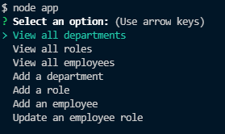
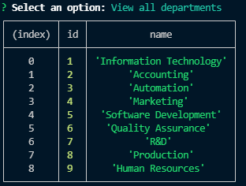
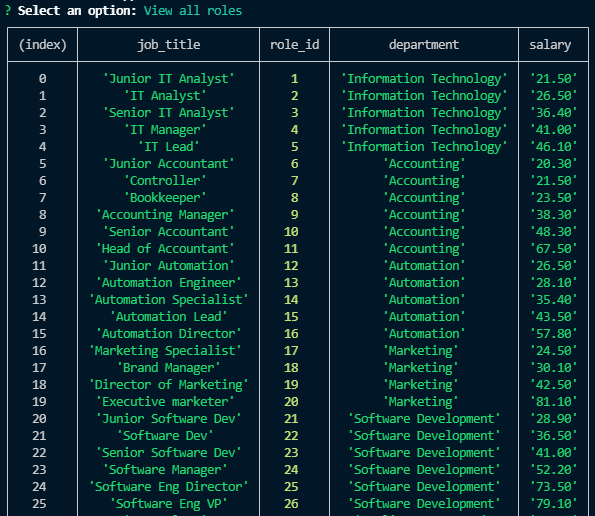
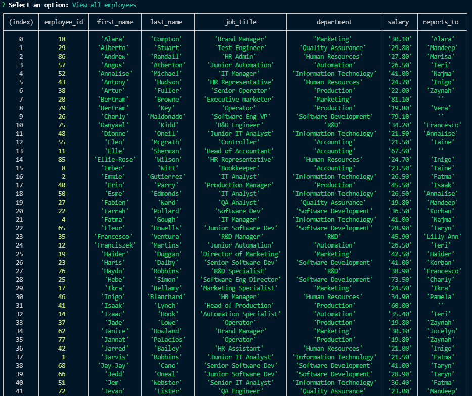
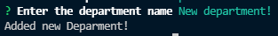
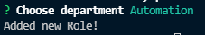
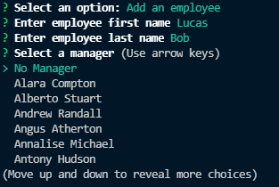
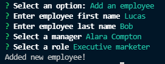
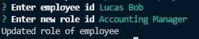
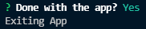

# Employee-Tracker

## Description
This is a simple content management system (CMS) to view employee database.
It is a simple command line application to view, update, and add to employee tables using inquirer and mysql2.

## Table of Contents
  * [Installation](#installation)
  * [Usage](#usage)
  * [Credits](#credits)
  * [License](#license)
  * [Contribute](#contributions)
  * [Tests](#tests)
  * [Questions](#questions)

## Installation
  1. clone repo on github 
  2. Install any required dependancies 
```
    npm install
```
  3. Enter your SQL database crendentials in .env file (see .env.Example)
```
    DB_HOST=<database hostname>
    DB_NAME=employees
    DB_USER=<database user>
    DB_PASS=<database password>
```
  4. Login to SQL on command line 
```
    mysql -u <user> -p
```
  5. Create database and tables
```
    source db/db.sql
    sourec db/schema.sql
```
  6. (Optional) Generate values on tables
```
    source db/seeds.sql
```
  6. Start the application on nodeJS
```
    node app
```
  

## Usage
  1. Once the application is started, it will prompt you on what actions to take   
    
  2. Select "View all departments" to view departments list   
    
  3. Select "View all roles" to view roles list   
    
  4. Select "View all employees" to view employees list   
    
  5. Select "Add a deparment" to add a new department and answer required prompts
    
  6. Select "Add a role" to add a new role and answer required prompts to link to a department. It pulls a list of existing departments to select from!   
       
    
  7. Select "Add an employee" to add a new employee and answer required prompts to link to a role. It pulls a list of existing roles and employees to select from!   
       
       
       
  8. Select "Update an employee role" to update an existing employee's   
    
  9. Select to do more actions on app or exit   
    

## Credits
N/A

## License
This application is under the MIT License  
For more information please view here: [MIT Description](https://choosealicense.com/licenses/mit/)

[](https://opensource.org/licenses/MIT)

## Contributions
Feel free to clone and improve on this application!

## Tests
[Demo Video](https://watch.screencastify.com/v/CY5A9teNaHf4ncx3IWFz)

## Questions

See more about my Github here:  [Fchoi1](https://www.github.com/Fchoi1)  
Any burning questions you want to ask me?  
Reach out to me! [fwchoi@uwaterloo.ca](mailto:fwchoi@uwaterloo.ca)
